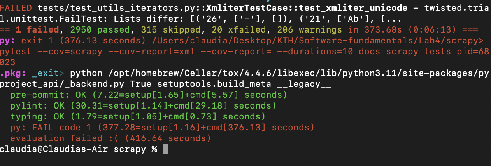
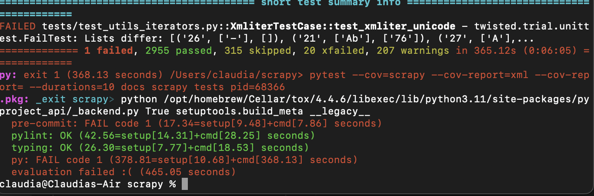

# Report for assignment 4

## Project

Name: [Scrapy](https://github.com/DD2480-Group10/scrapy)

### One or two sentences describing it
Scrapy is a python framework that can be used to crawl websites and extract data from their pages.

## Onboarding experience

### Did you choose a new project or continue on the previous one?

We decided to go with a new project since the previous one, [Javaparser](https://github.com/javaparser),
was a bit confusing because of it's lack of documentation, many moving parts and quite demanding data structures.

### If you changed the project, how did your experience differ from before?
- The project was much easier to grasp, due to it having a much better documentation. 
- All that was needed was to clone the repository and install "Tox" to run the test. 
- Some group members had some problems with setting up Tox for their WSL as it sometimes didn't sync up with their editor (vscode)
- Some group members had some issues with dependencies not working together
- There was some effort required in figuring out how to actually build/install/run the program inside the project
- It took quite some time to understand the issue, and the architecture
## Effort spent
| Group member | Plenary discussion | Discussion within group | Reading Documentation | Configuration and setup | Analyzing code | Writing documentation | Writing code | Running code |
|-|-|-|-|-|-|-|-|-|
|Jesper|3|2|3|0.5|5|2|8|3|
|Hans|4|2|3|2|4|1|4|2|
|Claudia|4|2|4|0.5|4|4|3|1|                                             
|Linus|4|2|3|1|3|1|1|2|
|Adam|4|1|3|1|4|1|3|1| 

- *Note* Due to the difficulties with the scrapy project most programming, resarch, and discussion was done during full group, or pair sessions, which is why the hour count is very similar between group members so far.

### For setting up tools and libraries (step 4), enumerate all dependencies you took care of and where you spent your time, if that time exceeds 30 minutes.

- Linus: Had issues with installing tox and getting it to run with a WSL on windows. Therefore had to
switch from from Git Bash to install Debian. From there I could just do a 'pip install tox' and then run the test with the tox command.

- Hans: I had issues with tox and incompatible versions of dependencies (specifically PyOpenSSL and crypto). Also issues with windows, switched to linux. 

## Overview of issue(s) and work done.

Title: Average Respons Time in Stats

The chosen issue can be found [here](https://github.com/scrapy/scrapy/issues/4889), and entails logging the average response time for the scrapy stats. The issue suggests implementing a *standalone scrapy extension*. 

## Why this issue is relevant

This issue is a feature request that has several use cases concerning optimizing the framework. It was suggested by a contributor that this feature would be nice to have as an extentsion. We therefore judge this issue to be relevant to resolve.

## Requirements for the new feature or requirements affected by functionality being refactored

##### Requirements
The requirements for the issue are listed in the table below.
| Requirement | ID | Title | Description |
|-------------|----|-------|-------------|
|Add extension averageresponse time|1|averageresponsetime|Log the average response time to scrapy stats via an extension.|
|Add event listenes through signals|1.1|Signals|Wait for event to occur before data is processed. Needed to calculate invdividual response time.|
|Calculate average response time|1.2|Calculate|Store and calculate the average response time.|
|Write average response time to log|1.3|Log|Write the average response time to the info log.|
|Add unit tests to extension|2| Average response time test | Test the extension
|Test invalid settings|2.1|Invalid settings|Test that the extension does not run when the settings are disabed.|
|Test single response|2.2|Single response|Test that a singe response is handled correctly.|
|Test multiple responses|2.3|Multiple responses|Test that multiple responses are handled correctly.|
|Test valid settings|2.4|Valid settings|Test that the extension is loaded but no average responstime is printed.|
|Documentation |  3  | Documentation    | document the extension, and corresponding tests  in the report         |
|||||

Optional (point 3): trace tests to requirements.

## Code changes

### Patch

The patch can be found on branch "feat/#3". Also the git command "git diff master feat/#3" can be used. 

Optional (point 4): the patch is clean.

Optional (point 5): considered for acceptance (passes all automated checks).

## Test results

Overall results with link to a copy or excerpt of the logs (before/after
refactoring).

### Existing test cases
*Note* when initially running all project tests we got the following:
- 2950 Passed
- 315 Skipped
- 1 Failed
- 20 XFailed
- 206 Warnings

### After added test cases
*Note* after adding our test and ran all project tests we got the following:
- 2955 Passed
- 315 Skipped
- 1 Failed
- 20 XFailed
- 207 Warnings

# Contributions

### New feature after issue resolution
| Feature | Issue | Commit | Purpose | Contributor | 
|------|-------|--------|---------|-------------|
|ResponseTime|#3|[commit](https://github.com/DD2480-Group10/scrapy/pull/18/commits/a8724c125adccea99688c7b36c36f808e759674f)|implement average response extension|Jesper|
<<<<<<< HEAD
|||||
=======
|ResponseTime enabling check|#29|[commit](https://github.com/DD2480-Group10/scrapy/pull/30/commits/bb7b0c4d11f09ec2af31f829d786dcdb8c6632a0)|This was added so that our extension only is used after a user has enabled it in the settings.|Claudia|
>>>>>>> 2e53a1c191d7c251e2221939c08f8d6e25d3b13c

### New test cases after issue resolution
*Note*: All tests are located in /tests/test_extension_averageresponse.py
| Test | Issue | Commit | Purpose | Contributor | 
|------|-------|--------|---------|-------------|
| test_print_average| #12       | [commit](https://github.com/DD2480-Group10/scrapy/commit/660a070e22246ba717ee953192055fb13d8aac7a)  |  test that the log works    |    Hans         |                
|   test_setting_disabled   |  #13     | [commit](https://github.com/DD2480-Group10/scrapy/commit/660a070e22246ba717ee953192055fb13d8aac7a)       |   ensure extension does not run when setting is disabled      |    Hans         |                
| test delayed spider response| #27 |[commit](https://github.com/DD2480-Group10/scrapy/pull/28/commits/e9511cb19d364242e87995e04f352499bde0f6df) |  test the response for delayed spiders   | Linus |                                

## UML class diagram and its description

### UML diagram

- A crawler object is passed to our ResponseTime extension, that is instantiated by the Crawler class.  
- The Crawler class is the main entry point to the Scrapy API. Where we for instance get access to the recorded stats of the crawlers behaviour and can be also used to catch signlas, via the SignalManager.
- The SignalManager is used to connect a reciever, i.e. the crawler, to a given signal. 
- Signals are objects that notifies when a certain event occurs. In our case, our class ResponseTime, tries to catch the following singlas:
    - spider_opened: Sent when a spider has been opened. 
    - spider_closed: Sent when a spider has been closed. 
    - request_reached_downloader: Sent when a Request has reached the downloader componen. 
    - response_received: Sent when the Engine component has recieved a Response from the Downloader component. 
- It is with the help of the signals that we are able to calculate the average response time of fetching the web pages.   
- Spider objects (from the Spider class) are needed due to it being custom classes that the users of the framework writes to. It is via that class that users are able to define how a site should be scraped. 
- The Settings class can be used to customize the behaviour of the system.
- The StatsCollector class is used to record scraping stats, in our case recording the amount of responses received.   

### Optional (point 1): Architectural overview.
Scrapy has 7 components that interact with each other. The components are: Scrapy Engine, Scheduler, Downloader, Spiders, Item Pipeline, Downloader Middlewares and Spider Middlewares. 

- Scrapy engine: The engine is responsible for the data flow between all the components. It handles the Requests and Responses given from the different components. 

- Scheduler: Handles the Requests that are received from the Engine and adds them to a queue. Where they later are fed to the Engine, when the Engine requests them. 

- Downloader: Is responsible for fetching web pages and then feeds them to the Engine, which later on feeds them to the so called Spiders. 

- Spiders: Used to parse the responses that are received by the Engine, which got them from the Downloader. They are  custom classes, which means that the users are able to define how a certain site (or group of sites) should be scraped and also how they should perform the crawl. The Spiders return the extracted data as Python objects called items.  The Spiders are

- Item Pipeline: Processes the items that have been scraped by the spiders. Each item pipeline component is responsible for performing a certain action over the received item and deciding if the item should continue through the pipeline or be dropped. Some examples of the uses of item pipelines are: cleansing HTML data, checking for duplicate data and storing scraped items in a database.

- Downloader Middlewares: Sits between the Engine and Downloader, where it processes the requests and responses that pass between these two components. They can be used to alter the requests and responses that flow between these components, e.g. silently drop some requests or pass responses to a spider without fetching a web page.

- Spider Middlewares: sits between the Spiders. They can be used to process the responses that are sent to the Spiders and the items and requests that are output from the Spiders. 

*Note* - The following image is taken from the Scrapy documentation which shows an overview of the system architecture:

### Optional (point 2): relation to design pattern(s).
The extension averageresponse.py has the function from_crawler, that scrapy has defined from earlier.
It's a function that is used in the framework. What it does is that is uses the crawler.signal where signal is the manager of the crawler.
The object Crawler provides access to all of the other Scrapy core components.

So from_crawlers is a class method meant to pass crawler objects to extensions and thereby hook their functionality
onto Scrapy. A design patterns to easily attach extensions to the Scrapy project.

## Overall experience

### What are your main take-aways from this project? What did you learn?
- That it is hard to find an open source project that works "out of the box".
- That it is really important to have a clear and concise documentation. Because even if a project seems to be well documented, it can still be hard to grasp how the system works overall and how to contribute to it. 
- That many issues that users report are often unclear and ambiguous.

### How did you grow as a team, using the Essence standard to evaluate yourself?
After looking at the table "Checklist for Team" at page 52 in the Essence standard v1.2 document, we consider ourselves to be in the "Collaborating"-state. That is because we consider oursevles to have fulfilled all the checklist items for the states "Seeded" and "Formed". We have had plenty of in-person and online meetings, done pair-programming and helped each other out when needed. This has helped us achieve the checklist items for these states. The communication within the team has is open, honest and effective. We believe that we are close to achieve the "Performing" state, but that we would need to work together a bit longer to e.g. achieve "The team members know and trust each other".  

From the earlier project several parts from the sections "Seeded" and "Formed" has been fulfilled. Since the first open-sourced project that we choose to work with, JavaParser, was quite confusing and difficult. Which more or less forced us to understand more how each of us work best and what we need to do to help each other out. Then with this second project, Scrapy, we have spent a lot of time working together to understand how the framework works, read up on the documentation, finding issues that we can work on etc. Which has helped us completly fulfill the parts on the "Seeded" and "Formed" states and some parts of the "Collaborating" state. 

### Optional (point 6): How would you put your work in context with best software engineering practice?
When looking at the checklist for "Software System" alpha in the solution area and try to relate it to our work, we see that we check most parts of the "Architecture Selected" state. One of the checklist items that we haven't really thought about when working on project is "Key technical risks agrred to" in the "Architecture Selected". Mainly due to time constraints. Another checklist item that we haven't thought about is "System boundary is known". Overall, we haven't thought about security related issues when developing our patch to the open source project. 

On the other hand when we look at the alpha "Work" in the endeavor area, we have can see that we fullfill most states and are right now on the "Under Control" state. Of course there are some points in the previous states that we can't achieve, due to this being a university course and not a real life project, e.g. "Funding to start the work is in place". Therefore, we have disregarded those types of checklist items, when assessing our work. 